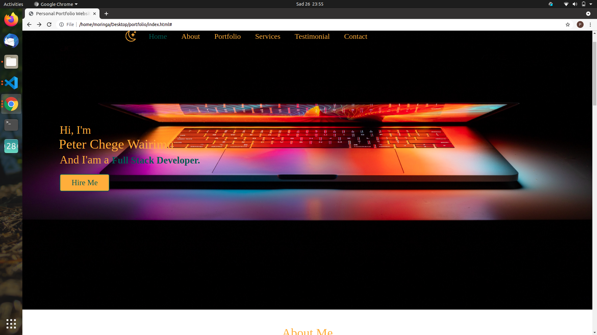

# My portfolio

## By Peter Chege Wairimu.

# Description 

This is a portfolio website for Peter Chege Wairimu. With this website, I can showcase my skills and projects that I have worked on. I have also included a contact form to get in touch with me. I look forward to hearing from you.

# Technologies Used

### (1).HTML.

### (2).Css.

### (3).Bootstrap.

### (4). Javascript.

# Support and contact details
Incase of any queries or any clarification you can contact me via email or phone.

### email. chegewairimu66@gmail.com

### phone. 0707569387

# License

License permission is hereby granted ,free of charge to anyone obtaining a copy of these software and associated documentation to deal in the software without restrictions including without limitation the rights to use ,copy modify ,publish and distribute copies of these software and to permit persons to whom the software is furnished to do so,subject to the following conditions:

The above copyright notice should be included.

## Copyright (c) 2021